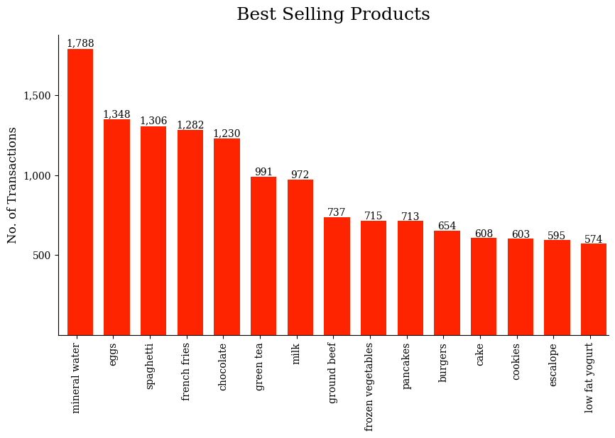
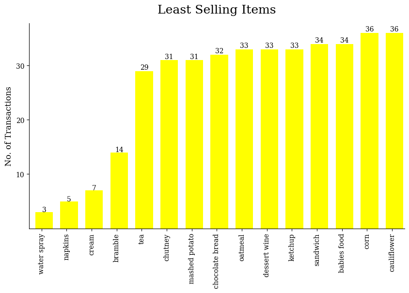
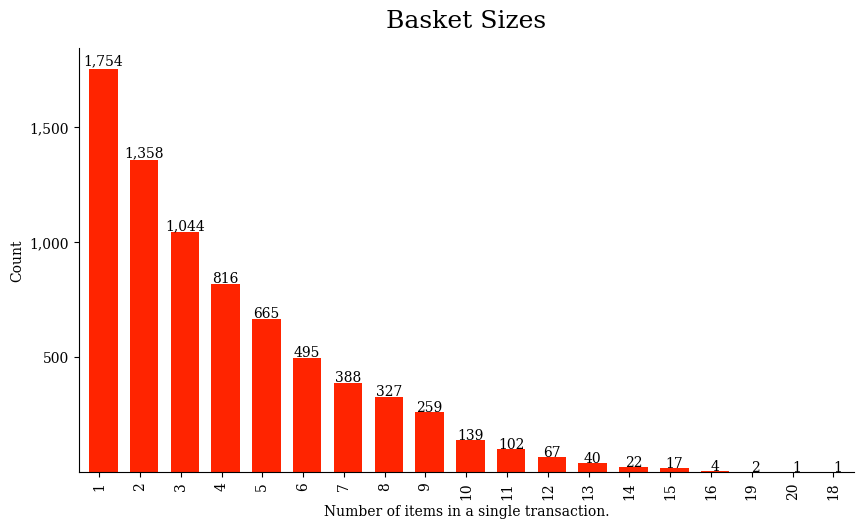
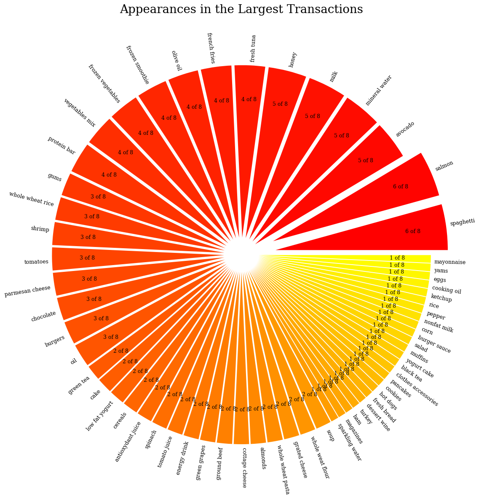
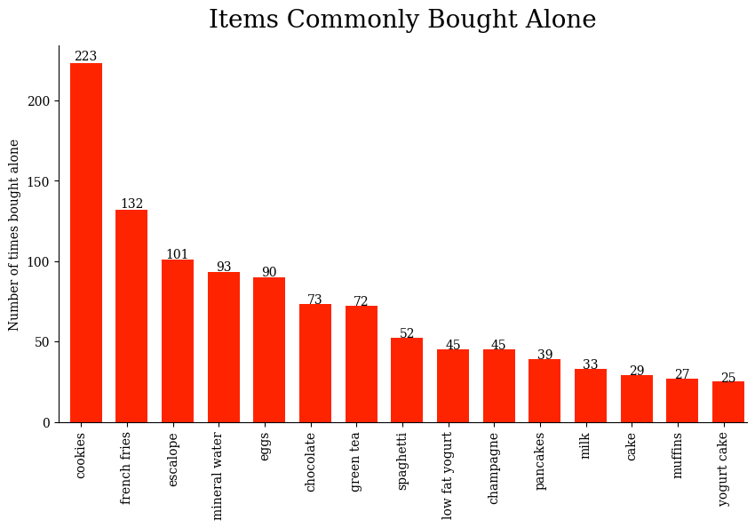

# Laporan Proyek Machine Learning

### Nama : Arum Rahmah Romadhoni

### Nim : 211351029

### Kelas : Pagi B

## Domain Proyek

Market basket (keranjang belanja) adalah istilah yang digunakan dalam analisis bisnis dan ekonomi untuk merujuk pada kumpulan produk atau barang yang dibeli oleh konsumen selama satu periode belanja tertentu. Ini mencakup sejumlah produk atau item yang sering dibeli bersama-sama oleh konsumen dalam satu transaksi atau kunjungan ke toko.

## Business Understanding

Memahami pola pembelian konsumen, kami membuat sistem ini untuk membantu perusahaan dalam strategi pemasaran, penentuan harga, dan manajemen stok. Dengan menggabungkan teknologi pemantauan canggih dan analisis data yang mendalam, kami memberikan solusi tidak hanya meningkatkan memahami pola pembelian konsumen, tetapi juga membantu toko atau perusahaan untuk meningkatkan efisiensi persediaan, meningkatkan layanan pelanggan, dan merancang kampanye promosi yang lebih efektif.

Bagian laporan ini mencakup:

### Problem Statements

- Ketidakpahaman pola pembelian
- Efisiensi stok dan manajemen persediaan
- Prediksi permintaan

### Goals

- Meningkatkan pemahaman terhadap pola pembelian konsumen untuk dapat merancang strategi pemasaran yang lebih efektif.
- Meningkatkan efisiensi stok dan manajemen persediaan dengan mengidentifikasi produk yang cenderung habis bersamaan.
- Menggunakan analisis market basket untuk memprediksi permintaan masa depan dan mengoptimalkan persediaan.
- ### Solution statements

  - Pengembangan platform Market Basket berbasis web, solusi pertama adalah mengembangkan platform Market Basket berbasis web yang mengintegrasikan data dari Kaggle.com untuk memberikan pengguna akses cepat dan mudah dalam informasi tentang Market Basket.
  - Menerapkan pemantauan terus-menerus menggunakan algoritma Apriori untuk mengidentifikasi dan beradaptasi dengan perubahan perilaku konsumen dalam market basket.

## Data Understanding

Dataset yang saya gunakan berasal dari Kaggle yang berisi market basket. Dataset ini mengandung 20 kolom.

Contoh: [Association Rule Learning](https://www.kaggle.com/datasets/sivaram1987/association-rule-learningapriori/data).

### Variabel-variabel pada Market Basket Dataset adalah sebagai berikut:

- Shrimp (Udang): Jenis makanan laut yang populer, kaya protein dan rendah lemak.
- Almonds (Almond): Biji-bijian kaya nutrisi, tinggi serat, dan lemak sehat.
- Avocado (Alpukat): Buah lezat yang mengandung lemak sehat, serat, dan berbagai nutrisi.
- Vegetables Mix (Campuran Sayuran): Kombinasi berbagai jenis sayuran yang bisa mencakup wortel, brokoli, kacang polong, dll.
- Green Grapes (Anggur Hijau): Buah anggur dengan kulit hijau, kaya antioksidan.
- Whole Wheat Flour (Tepung Gandum Utuh): Tepung yang berasal dari gandum utuh, kaya serat.
- Yams (Ubi Jalar): Sayuran akar yang kaya karoten dan serat.
- Cottage Cheese (Keju Cottage): Jenis keju yang rendah lemak dan tinggi protein.
- Energy Drink (Minuman Energi): Minuman yang mengandung bahan-bahan seperti kafein, gula, dan elektrolit untuk memberikan energi tambahan.
- Tomato Juice (Jus Tomat): Jus yang dihasilkan dari tomat, mengandung vitamin C dan likopen.
- Low-Fat Yogurt (Yogurt Rendah Lemak): Produk susu fermentasi rendah lemak, kaya akan probiotik dan protein.
- Green Tea (Teh Hijau): Minuman herbal yang dikenal karena kandungan antioksidannya.
- Honey (Madu): Pemanis alami yang mengandung berbagai nutrisi dan memiliki sifat antibakteri.
- Salad: Campuran sayuran segar dan bahan-bahan lainnya, sering dihidangkan sebagai hidangan pembuka atau utama.
- Mineral Water (Air Mineral): Air yang mengandung mineral alami dan biasanya bebas kalori.
- Salmon: Jenis ikan yang kaya akan asam lemak omega-3, protein, dan nutrisi penting lainnya.
- Antioxidant Juice (Jus Antioksidan): Jus yang mengandung zat antioksidan untuk mendukung kesehatan.
- Frozen Smoothie (Smoothie Beku): Minuman yang terbuat dari buah-buahan yang diblender dan beku.
- Spinach (Bayam): Sayuran hijau yang kaya akan zat besi, kalsium, dan vitamin.
- Olive Oil (Minyak Zaitun): Minyak yang diekstrak dari buah zaitun, kaya akan lemak sehat.

## Data Preparation

### Data Collection

Dalam data collection ini, saya mendapatkan dataset yang nantinya akan digunakan dari website kaggle dengan nama dataset Association Rule Maining. Dataset bisa di download pada link diatas.

### Data Discovery and Profiling

Pertama kita mengimport semua library yang dibutuhkan,
``` bash
import pandas as pd
import matplotlib as mpl
import seaborn as sns
from matplotlib.axes import Axes
```

Karena kita menggunakan google colab untuk mengerjakannya maka kita akan import files juga,
``` bash
from google.colab import files
```

Lalu mengupload token kaggle agar nanti bisa mendownload sebuah datasets dari kaggle melalui google colab
``` bash
files.upload()
```

Setelah mengupload filenya, maka akan lanjut dengan membuat sebuah folder untuk menyimpan file kaggle.json yang sudah diupload tadi,
``` bash
!mkdir -p ~/.kaggle
!cp kaggle.json ~/.kaggle/kaggle.json
!chmod 600 ~/.kaggle/kaggle.json
!ls ~/.kaggle
```

Lalu mari kita download datasets nya,
``` bash
!kaggle datasets download -d sivaram1987/association-rule-learningapriori
```

Selanjutnya kita harus extract file yang tadi telah didownload
``` bash
!mkdir association-rule-learningapriori
!unzip association-rule-learningapriori.zip -d cassociation-rule-learningapriori
!ls association-rule-learningapriori
```

Lanjut dengan memasukkan file csv yang telah diextract pada sebuah variable,
``` bash
data = pd.read_csv('cassociation-rule-learningapriori/Market_Basket_Optimisation.csv')
```

Lalu kita akan membaca data yang mungkin tidak memiliki header, dan memberikan nama kolom dengan format "item_1", "item_2"
``` bash
header=None,
names=[f"item_{idx}" for idx in range(1, 21)]
```

Dan disini akan mencetak informasi tentang total transaksi, serta rentang jumlah item dalam setiap transaksi.
``` bash
print(
    f"There were a total of {data.shape[0]:,} transactions, each containing",
    f"between {data.notna().sum(axis=1).min()} and {data.shape[1]} items.\n"
)
```

kemudian kita akan menampilkan data yang ada dalam variabel 'data'.
``` bash
data.head()
```

kita juga akan mengambil sampel acak sejumlah baris tertentu (contoh, 10) dari DataFrame.
``` bash
data.sample(10)
```

untuk  melihat informasi tentang jumlah baris, jumlah kolom, tipe data setiap kolom, jumlah nilai non-null dalam setiap kolom, dan penggunaan memori oleh DataFrame.
``` bash
data.info()
```

Lalu kita akan mengidentifikasi dan membersihkan nilai-nilai dalam kolom "value" yang dimulai atau diakhiri dengan spasi.
``` bash
#Data Cleaning
all_products = data.melt()["value"].dropna().sort_values()

# Find items that start or end with whitespace
all_products[all_products.str.contains("^\s|\s$")].to_list()
```

Disini kita akan mengganti nilai " asparagus" dengan "asparagus" dalam DataFrame dan variabel all_products.
``` bash
data.replace(" asparagus", "asparagus", inplace=True)
all_products.replace(" asparagus", "asparagus", inplace=True)

print(f"There are {all_products.nunique()} different products:\n\n", all_products.unique())
```

Mari kita tampilkan diagram batang yang menunjukkan 15 produk terlaris berdasarkan jumlah transaksi.
``` bash
item_counts = all_products.value_counts()

ax = item_counts.nlargest(15).plot(kind="bar", title="Best Selling Products")
ax.set_ylabel("No. of Transactions", size=12)
ax.yaxis.set_major_formatter(mpl.ticker.StrMethodFormatter("{x:,.0f}"))
ax.yaxis.set_major_locator(mpl.ticker.FixedLocator([500, 1000, 1500]))

_ = annotate_column_chart(ax)
```


Lalu kita tampilkan diagram batang yang menunjukkan 15 produk yang paling sedikit terjual berdasarkan jumlah transaksi.
``` bash
ax = item_counts.nsmallest(15).plot(kind="bar", color="yellow", title="Least Selling Items")
ax.set_ylabel("No. of Transactions", size=12)
ax.yaxis.set_major_locator(mpl.ticker.FixedLocator([10, 20, 30]))

_ = annotate_column_chart(ax)
```


Bisa kita lihat dalam diagram batang dibawah ini, menunjukkan distribusi ukuran keranjang dalam data, diukur berdasarkan jumlah item dalam satu transaksi.
``` bash
basket_sizes = data.notna().apply(sum, axis=1)

ax = basket_sizes.value_counts().plot.bar(title="Basket Sizes")
ax.set_ylabel("Count")
ax.set_xlabel("Number of items in a single transaction.")
ax.yaxis.set_major_formatter(mpl.ticker.StrMethodFormatter("{x:,.0f}"))
ax.yaxis.set_major_locator(mpl.ticker.FixedLocator([500, 1000, 1500]))

_ = annotate_column_chart(ax)
```


Kita lihat juga diagram pie (pie chart) yang menunjukkan kemunculan produk dalam transaksi terbesar, dengan lebih dari 15 item.
``` bash
items_in_largest_transactions = data[basket_sizes > 15].melt()['value'].dropna()

pie_data = items_in_largest_transactions.value_counts()
ax = pie_data.plot.pie(
    cmap="autumn",
    explode=[0.2] * 2 + [0.1] * 59,
    figsize=(12, 12),
    autopct=lambda pct: f" {pct * 0.01 * pie_data.sum():.0f} of 8",
    pctdistance=0.8,
    labeldistance=1.02,
    rotatelabels=True,
    textprops={"size": 9},
)
ax.set_title("Appearances in the Largest Transactions", size=20, pad=45)
ax.set_ylabel("")
ax.figure.tight_layout()
```


Dibawah ini adalah diagram batang yang memberikan informasi tentang jumlah kemunculan setiap produk dalam transaksi dengan hanya satu item.
``` bash
single_items = data[basket_sizes == 1]["item_1"].value_counts()
ax = single_items.head(15).plot.bar()
ax.set_title("Items Commonly Bought Alone", size=20, pad=15, weight=500)
ax.set_ylabel("Number of times bought alone")

_ = annotate_column_chart(ax)
```


Selanjutnya kita akan membuat variabel baskets yang berisi tuple-tuple dari setiap baris dalam DataFrame 'data' yang memiliki ukuran keranjang lebih dari 1
``` bash
baskets = [tuple(row.dropna()) for _, row in data[basket_sizes > 1].iterrows()]
baskets[-5:]
```

## Modeling

Sebelumnya mari kita menginstal pustaka efficient-apriori menggunakan perintah pip, dan kemudian mengimpor modul apriori dari pustaka tersebut.
``` bash
!pip -qq install efficient-apriori
from efficient_apriori import apriori
``` 

Kemudian kita akan memanggil fungsi apriori yang disimpan dalam variabel item_sets dan association_rules, dengan menggunakan nilai min_support dan min_confidence yang sesuai.
``` bash
item_sets, association_rules = apriori(baskets, min_support=0.03, min_confidence=0.3)
```

Lalu kita akan mendapatkan dan mencetak aturan asosiasi satu-satu yang memiliki panjang satu pada sisi kiri dan satu pada sisi kanan, diurutkan berdasarkan nilai lift. Dan pada aturan-aturan tersebut memberikan wawasan tentang keterkaitan dan kekuatan hubungan antara pasangan item.
``` bash
one_to_one_rules = filter(
    lambda rule: len(rule.lhs) == 1 and len(rule.rhs) == 1, association_rules
)
for rule in sorted(one_to_one_rules, key=lambda rule: rule.lift):
    print(rule)
```

## Evaluation

Hasil analisis berdasarkan data transaksi yang ada adalah dengan menggunakan minimum support 1% (kuatnya kombinasi item tersebut dalam database) dan minimum confidence 30% (kuatnya hubungan antar item dalam aturan asosiasi) menghasilkan 115 aturan asosiasi. Salah satu contohnya yaitu jika konsumen membeli soup maka 56,1% (kepastian konsumen dalam membeli item) akan membeli mineral water.

## Deployment
Dalam analysis ini yang akan menghasilkan rekomendasi yaitu eggs,shrimp,low fat yogurt,chocolate,cake,spaghetti,tomatoes,pancakes,milk,frozen vegetables,frozen vegetables,ground beef,olive oil,burgers,soup,ground beef.

[Market Basket Analysis Menggunakan Algoritma Apriori](https://aappciationrulesuas.streamlit.app/).
